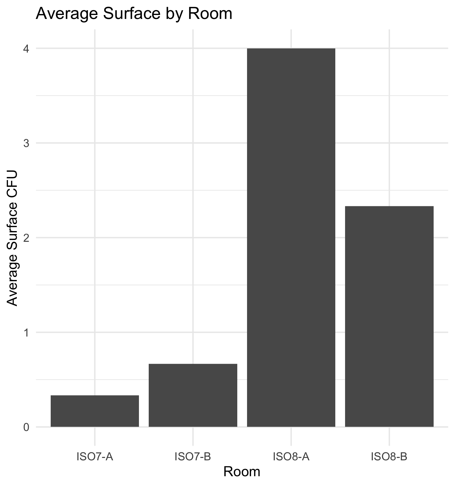
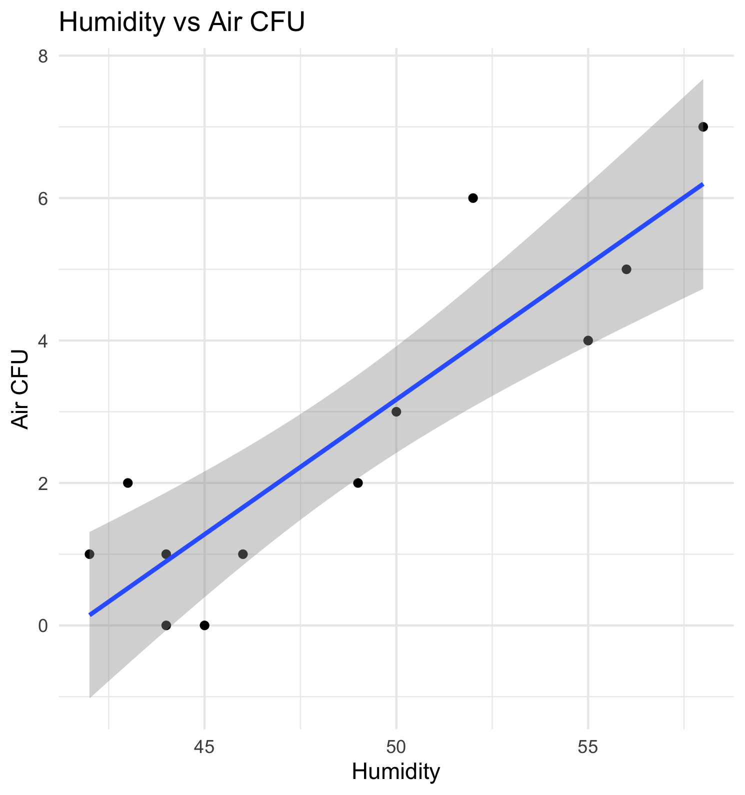
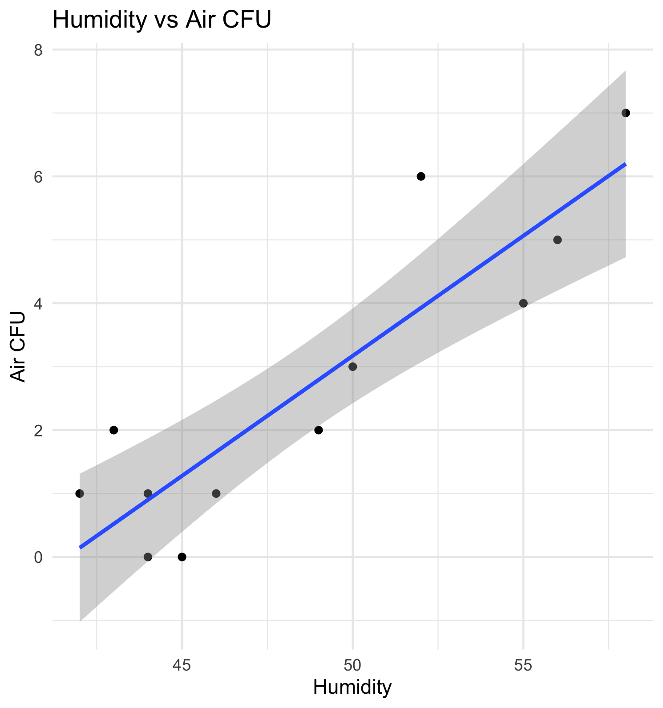

# Environmental Monitoring Data Analysis 

## Project Overview
As a microbiologist, analyzing environmental monitoring (EM) data and identifying trends are important parts of understanding microbial conditions in controlled environments. Using a simulated environmental monitoring dataset, I developed and applied R programming and data analysis skills while working with data relevant to my scientific background.

## Objectives
- Compare Air CFU and Surface CFU levels across monitored rooms.
- Evaluate microbial trends over time.
- Examine relationships between environmental conditions, including temperature and humidity, and microbial counts.
- Practice using R for data cleaning, analysis, and visualization.

## Dataset
This project uses a simulated environmental monitoring dataset containing data from four monitored rooms. The dataset includes temperature, humidity, Surface CFU, and Air CFU measurements collected across multiple dates.

The dataset is entirely simulated and does not contain proprietary or confidential laboratory data.

## Tools & Skills
- **R / RStudio** – data analysis and workflow development
- **Summary Statistics** – calculated averages and compared microbial counts across rooms
- **Correlation Analysis** – evaluated relationships between environmental conditions and microbial counts
- **Trend Analysis & Data Visualization** – analyzed changes over time and created graphs using `ggplot2`

## Key Findings

- ISO8 rooms showed higher microbial counts overall than ISO7 rooms, with ISO8-A having the highest average Air CFU and Surface CFU.**
- Humidity showed a strong positive correlation with Air CFU (r ≈ 0.89), indicating that higher humidity values were associated with higher airborne microbial counts in this simulated dataset.**
- Temperature showed a strong positive correlation with Surface CFU (r ≈ 0.92), indicating that higher temperatures were associated with higher surface microbial counts in this simulated dataset.**

## Visualizations

### Average Surface CFU by Room

### Air CFU Trends Over Time

### Surface CFU Trends Over Time

### Humidity vs Air CFU

## Conclusion

This project demonstrates the use of R to analyze and visualize environmental monitoring data. Through data cleaning, summary statistics, trend analysis, and correlation analysis, I identified patterns in microbial counts across controlled environments and examined their relationships with temperature and humidity.

Because this dataset is simulated and contains a limited number of observations, the findings are intended to demonstrate data analysis techniques rather than draw conclusions about real-world cleanroom performance.